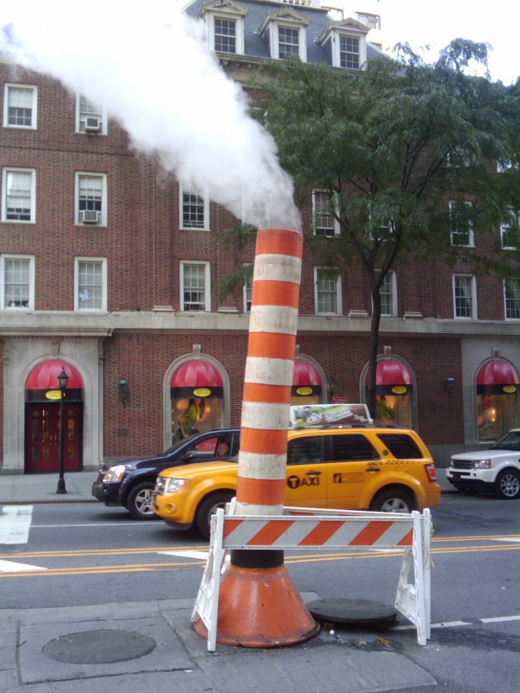
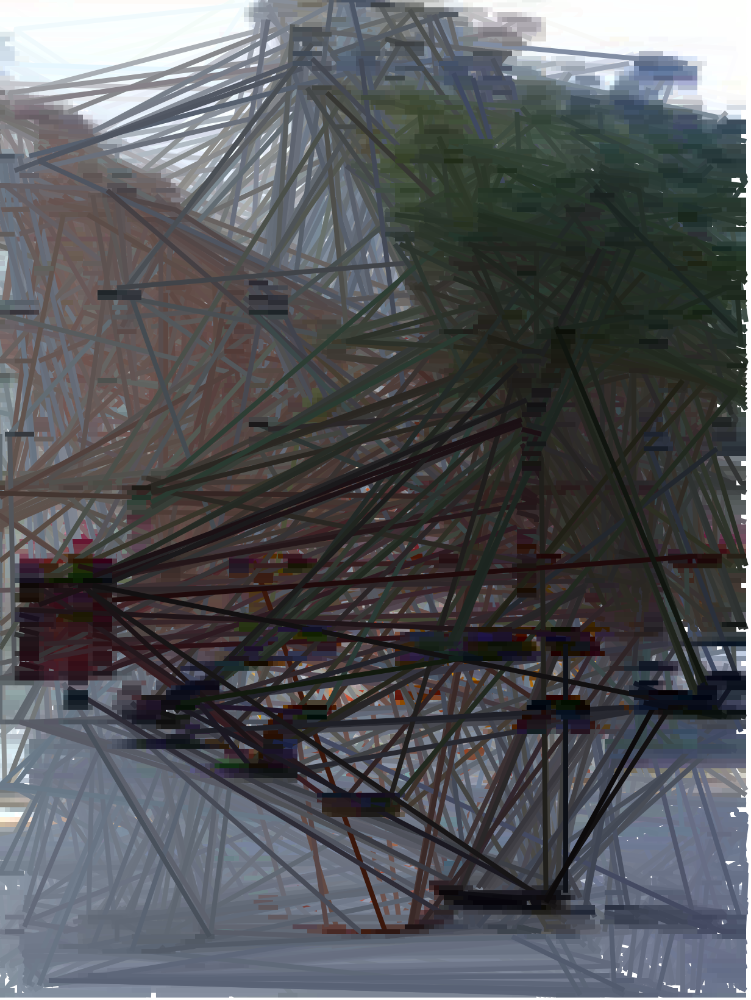
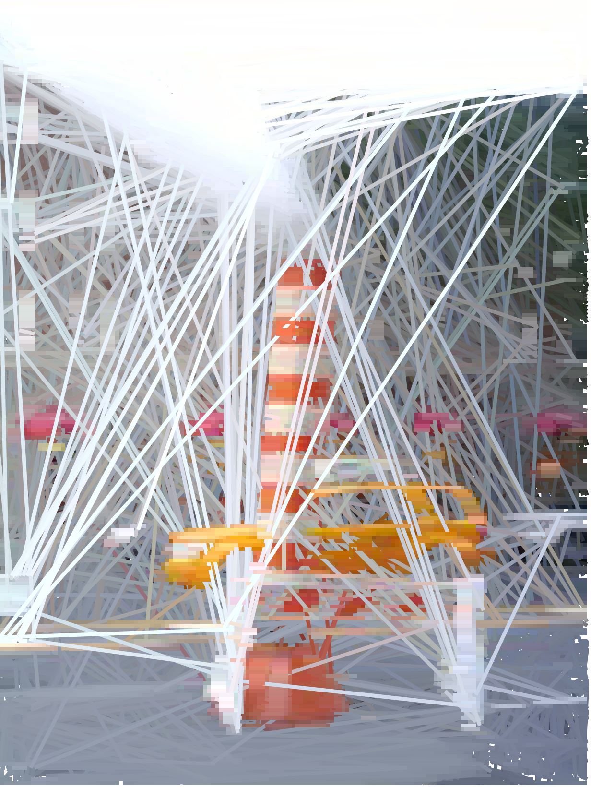
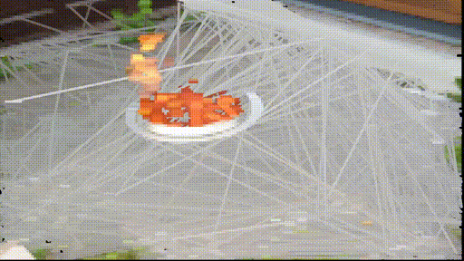

# Every Frame A Painting

Sorts pixels in an image by colour and redraws the image in order. See examples below.

Works best with smaller image sizes or memory usage and time to draw will be huge.

## Install

```bash
go install github.com/tsak/everyframeapainting
```

## Usage

```bash
Usage of everyframeapainting:
  -in string
        GIF, PNG or JPEG to read from
  -normal
        Normal colour sort (might give better results)
  -out string
        PNG to write to
```

## Movie conversion

Requires `ffmpeg` and Image Magick `convert` to be installed. Only tested on Linux (Ubuntu 20.x)

See [movie.sh](movie.sh)

```bash
Usage:
./movie.sh: <infile>.mp4 <outfile>.mp4 [-normal|-reverse] [xx%]
```

## Example

### Input



### Output



Using `-normal` flag



### Converting a movie


